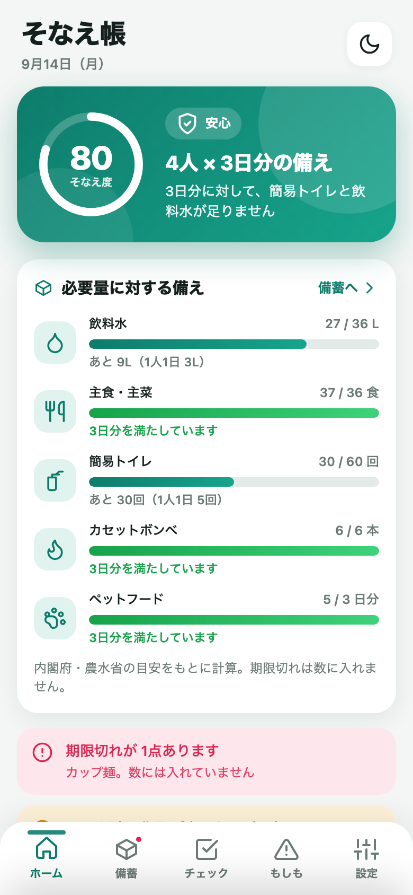
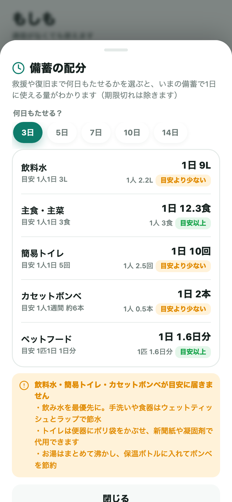
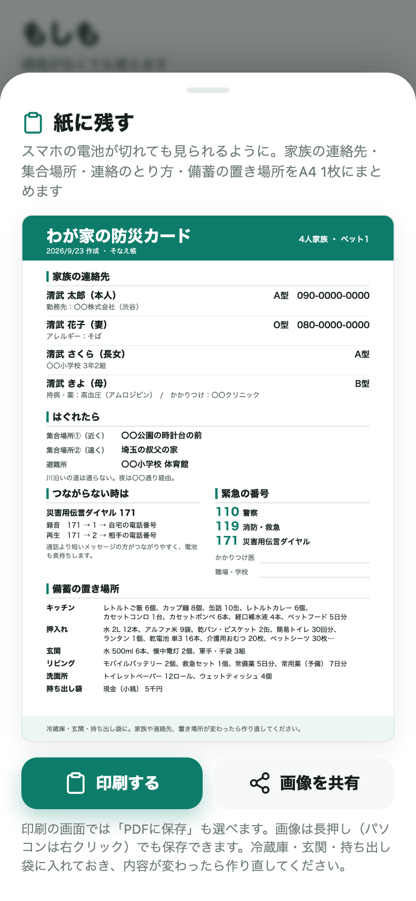

# そなえ帳 — 家庭の備蓄と防災の手帳

世帯人数から「水・食料・トイレ」の必要量を計算し、**いまの備蓄で何日すごせるか**と**次にやること**を示し、賞味期限を見守り、もしもの時は通信なしで使える道具箱になるアプリ。
**清武の自主企画**（テーマ選定から設計・実装まで自分で行ったもの）。提案の背景は [資料/岩崎さんへの提案書.md](資料/岩崎さんへの提案書.md) にまとめてある。

| ホーム | 備蓄の配分 | 紙に残す防災カード |
|---|---|---|
|  |  |  |

| 項目 | 内容 |
|---|---|
| 状態 | **v1.1.0。Web版 完成 / PWA対応 / iOSプロジェクト構築済み（GitHub Actions でビルド確認）。引き渡し可** |
| Web公開・サポートURL | https://kiyotake1229.github.io/sonaecho/ （GitHub Pages。`?demo=1` でサンプル入り） |
| 開発確認用 | https://claude.ai/code/artifact/06991fa1-4947-410d-8bdd-869830ed2f6d （Claude Artifact） |
| 提案資料（プレゼン用ページ） | https://claude.ai/code/artifact/2fc71742-57bc-4d93-9e82-377e273f4665 （元ファイル: `資料/プレゼン資料/提案書.html`） |
| リポジトリ | https://github.com/kiyotake1229/sonaecho |
| Bundle ID | `work.ltv.sonaecho` |
| 本体 | `index.html`（約160KB。CSS/JS/データすべて内包。外部ライブラリなし） |
| 通信 | なし（完全オフライン） |
| データ | 端末内のみ（localStorage。iOS版は Preferences にも二重保存） |
| ネイティブ機能 | ローカル通知（期限・点検日）、触覚フィードバック、共有シート（安否連絡・家族カード）、画像の保存・共有（防災カード） |

---

## 社内説明資料

岩崎さんに説明するときの資料一式は `資料/` にある（開発ドキュメントとは別）。

| 資料 | 場所 |
|---|---|
| 提案書（プレゼン用ページ） | https://claude.ai/code/artifact/2fc71742-57bc-4d93-9e82-377e273f4665 |
| 提案書（PDF。そのまま配れる） | `資料/プレゼン資料/そなえ帳_提案書.pdf` |
| 提案書（文書版） | [資料/岩崎さんへの提案書.md](資料/岩崎さんへの提案書.md) |
| 話す台本 | [資料/プレゼンの進め方.md](資料/プレゼンの進め方.md) |
| 画面の画像 | `資料/プレゼン資料/screenshots/`（`bash tools/take-shots.sh` で作り直せる） |

## 開発ドキュメント

開発の記録は `docs/` で管理している。命名規則・連番のルールは [docs/README.md](docs/README.md)。一覧は `docs/manager/docs.json`。

| 番号 | 内容 |
|---|---|
| #0001 | 現状の仕様と構成（v1.0 時点） |
| #0002 | ホームで「何日もつか」と「次にやること」を示す |
| #0003 | 期限の登録と買い足しの流れを改善 |
| #0004 | 非常時の「備蓄の配分」計算 |
| #0005 | 防災カードを紙に残す（印刷・画像） |
| #0006 | iOSの共有シート・点検日などの不具合修正 |
| #0007 | 削除や「使った」を元に戻せるように |
| #0008 | プリセットとチェックリストの追加、ボンベの目安の修正 |
| #0009 | 資料と説明文の更新 |

機能追加・バグ修正・改善をしたら、1件ごとに文書を足して `bash docs/manager/generate_docs_json.sh` を実行する。

---

## 何ができるか

### ホーム
- **いまの備蓄で何日すごせるか**を大きく表示（水・主食・簡易トイレのうち最初に尽きるもの。例「約1.5日。簡易トイレが先に尽きます」）
- **次にやること**: そなえ度が上がる順に3件（例「飲料水をあと9L ＋7点」）。タップで買い足しリストに入る・チェックリストが開く。期限が未登録の品があれば「期限を登録する」も出る
- **そなえ度**（0〜100）と段階名。水・食料・トイレが目標に届くまでは「あと少し」まで
- 必要量に対するバーと「足りない分を買い足しリストへ」（何をいくつ買えばよいかを自動計算）
- 期限切れ・期限間近・買い足しリスト・点検の時期のお知らせ、もしもの道具へのショートカット、日替わりのひとこと
- サンプルデータ表示中は上部に帯が出て、「自分の記録を始める」で最初の設定に戻れる

### 備蓄
- **146種類**のプリセット（単位・1つあたりの量・目安の保存期間・置き場所つき）から選ぶだけで登録。自分で入力も可
- 一覧（分類ごと／**置き場所ごと**）／期限順／買い足しリスト
- 期限の入力は「今日から 半年・1年・2年・3年・5年」のボタンで速く。期限が未登録の品は**まとめて登録**できる
- 「1つ使った」で数量が減り、買い足しリストに自動追加。買ったら「備蓄へ」で登録。残っている分と期限が違うときは**別の行（ロット）**として登録し、使いきった古い行は自動で片付く（**ローリングストック**が一周する）
- 削除・使った・リストの操作は5秒間「元に戻す」ができる

### チェック
- 非常持ち出し袋／在宅避難の備え／家の安全対策／情報・連絡の備え の4リスト（基本61項目）
- 乳幼児・高齢者・ペットがいる世帯では、4つのリストそれぞれに項目が増える（全部該当で80項目）。自分の項目も追加可

### もしも（通信なしで動く道具箱）
- **ライト**（画面全体を白く。SOSのモールス点滅つき）
- **ホイッスル**（Web Audioで合成した大音量の警笛。音源ファイルなし）
- **家族カード**（血液型・アレルギー・持病・連絡先。発信ボタンつき）
- **集合場所**・避難所のメモ
- **安否連絡**（名前・場所・時刻入りの定型文 → コピー／共有シートで送信）
- **災害メモ**（時刻つきの記録）
- **備蓄の配分**（救援まで3〜14日もたせるとき、1日・1人あたりに使える量と目安との比較）
- **紙に残す**（家族の連絡先・集合場所・171・緊急の番号・備蓄の置き場所を A4 1枚の防災カードに。印刷・PDF・画像保存）
- **行動ガイド**（地震・津波・台風大雨・火災・停電・断水）、災害用伝言ダイヤル171の手順、節電・節水のコツ

### 設定
- 世帯（大人・子ども・乳幼児・高齢者・ペット）と目標日数（3日分／1週間分）
- 通知（期限の何日前か、年2回の点検リマインド）
- テーマ（端末に合わせる／ライト／ダーク）
- バックアップ（文字列のコピー／共有）と復元、サンプルデータ、全削除

## 必要量の根拠

農林水産省「家庭備蓄ポータル」（災害時に備えた食品ストックガイド）と内閣府の防災情報をもとにしている。

| 品目 | 目安 |
|---|---|
| 飲料水 | 1人1日 3L |
| 食料（主食・主菜） | 1人1日 3食 |
| 簡易トイレ | 1人1日 5回 |
| カセットボンベ | 1人1週間 約6本（農林水産省。使用期限は約7年） |
| おむつ | 乳幼児1人1日 8枚 |
| ペットフード | 1匹1日 1日分 |
| 日数 | 最低3日、推奨1週間 |

## ファイル構成

```
そなえ帳/
  index.html              アプリ本体（CSS/JS/プリセット・チェックリスト・行動ガイドすべて内包）
  README.md               このファイル
  manifest.json / sw.js   PWA用
  icon.svg                アイコン元データ
  icon-192.png / icon-512.png / apple-touch-icon.png
  docs/                   開発ドキュメント（仕様・変更の記録）
  資料/                   社内説明資料（提案書・台本・プレゼン資料と画面の画像）
  tools/                  アイコン生成（icon-gen.html, make-icons.sh）、スクリーンショット撮影（shot.html, take-shots.sh）
  ios-app/                iOSアプリ（Capacitor）。手順は ios-app/岩崎さんへの引き渡し手順.md
  .github/workflows/      iOSビルド確認（GitHub Actions・macOSランナー）
```

## 動作確認のしかた

- スマホの Safari / Chrome で https://kiyotake1229.github.io/sonaecho/ を開く（インストール不要）
- 「共有」→「ホーム画面に追加」でアプリとして起動できる（PWA・オフライン可）
- **設定 → 「サンプルデータを読み込む」** で、4人世帯（子ども・高齢者・ペットあり）の記入済み状態を体験できる。プレゼンはこの状態で行うとわかりやすい
- URLに `?demo=1` を付けて開くと、初回からサンプルデータ入りで起動する（その端末のブラウザに保存される。ホームの帯の「自分の記録を始める」で消せる）

## 修正したいとき

`index.html` を直す → commit → push で GitHub Pages に反映（数分）。iOS版は `ios-app/` で `npm run sync` → Xcode で再ビルド。

```bash
git add -A && git commit -m "[#連番] 変更内容" && git push
```

push すると GitHub Actions が macOS 上で iOS の署名なしビルドを実行する（https://github.com/kiyotake1229/sonaecho/actions ）。

## 残作業

- [x] GitHub Actions での iOSビルド成功を確認（v1.0: 2026-09-14。v1.1 はプラグイン追加後に再確認）
- [ ] 実機で触覚・通知・共有シート・防災カードの保存とプリント・ホイッスルの音量を確認
- [ ] App Store 用スクリーンショット（6.7 / 6.5 / 5.5 インチ。iPad 対応のため 13インチも求められる可能性あり）
- [ ] Apple Developer Program 登録 → 岩崎さんへ引き渡し

## 今後の候補

- 備蓄のバーコード読み取り登録（カメラ。ネイティブプラグイン）
- 家族間の備蓄共有（QRコードでのデータ受け渡し。通信なしのまま実現できる）
- 自治体の避難所データの取り込み（オフライン用にダウンロード）
- 企業・オフィス向けの備蓄管理モード（従業員数ベース。法人向け展開の入口）
