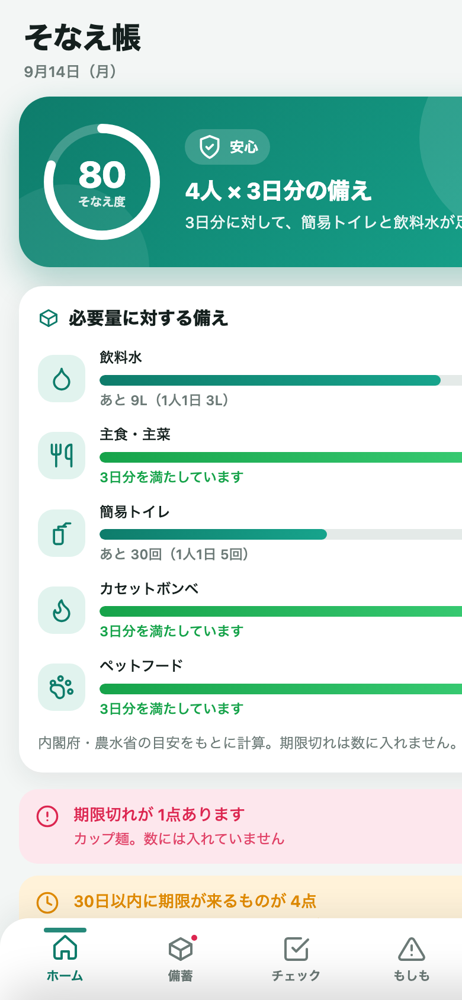
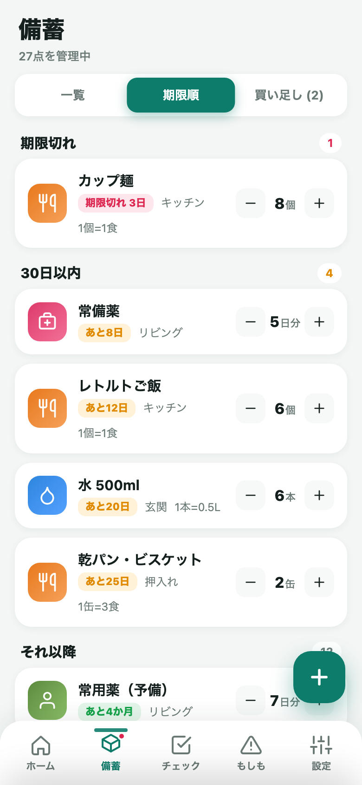
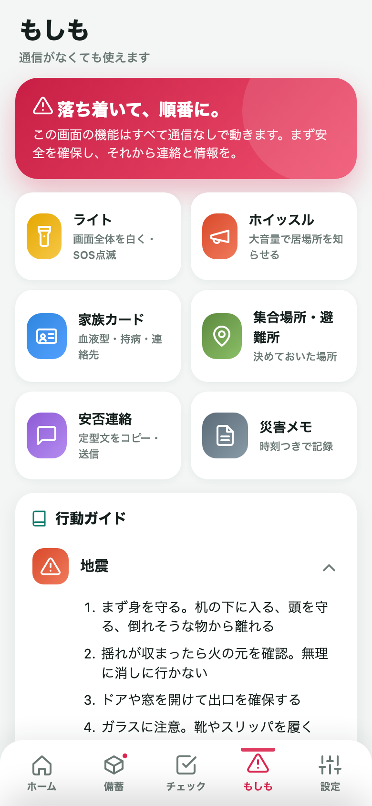

# そなえ帳 — 家庭の備蓄と防災の手帳

世帯人数から「水・食料・トイレ」の必要量を自動計算し、賞味期限を見守り、もしもの時は通信なしで使える道具箱になるアプリ。
**清武の自主企画**（テーマ選定から設計・実装まで自分で行ったもの）。提案の背景は [岩崎さんへの提案書.md](岩崎さんへの提案書.md) にまとめてある。

| ホーム | 備蓄（期限順） | もしも |
|---|---|---|
|  |  |  |

| 項目 | 内容 |
|---|---|
| 状態 | **Web版 完成 / PWA対応 / iOSプロジェクト構築済み・GitHub Actions でビルド成功確認済み（引き渡し可）** |
| Web公開・サポートURL | https://kiyotake1229.github.io/sonaecho/ （GitHub Pages） |
| 開発確認用 | https://claude.ai/code/artifact/06991fa1-4947-410d-8bdd-869830ed2f6d （Claude Artifact） |
| 提案資料（プレゼン用ページ） | https://claude.ai/code/artifact/2fc71742-57bc-4d93-9e82-377e273f4665 （元ファイル: 提案資料/提案書.html） |
| リポジトリ | https://github.com/kiyotake1229/sonaecho |
| Bundle ID | `work.ltv.sonaecho` |
| 本体 | `index.html`（約125KB。CSS/JS/データすべて内包） |
| 通信 | なし（完全オフライン） |
| データ | 端末内のみ（localStorage。iOS版は Preferences にも二重保存） |
| ネイティブ機能 | ローカル通知（期限・点検日）、触覚フィードバック、共有シート |

---

## 何ができるか

### ホーム
- **そなえ度**（0〜100）をリングで表示。世帯人数×目標日数（3日/1週間）に対する充足率、チェックリスト、連絡の備え、期限管理から算出。内訳はタップで確認できる
- 飲料水・主食・簡易トイレ・カセットボンベ（＋世帯に応じておむつ・ペットフード）の**必要量に対するバー**
- 期限切れ・期限間近・買い足しリスト・点検日のお知らせ
- 日替わりの防災ひとこと、もしもの道具へのショートカット

### 備蓄
- 120種類以上のプリセット（単位・1つあたりの量・目安の保存期間・置き場所つき）から選ぶだけで登録。自分で入力も可
- 一覧（分類フィルタ）／期限順（期限切れ・30日以内・90日以内…）／買い足しリスト
- 「1つ使った」で数量が減り、買い足しリストに自動追加。買ったら「備蓄へ」で数量に戻す（**ローリングストック**が自然に回る）
- 期限切れは必要量に数えない。期限は色分け

### チェック
- 非常持ち出し袋／在宅避難の備え／家の安全対策／情報・連絡の備え の4リスト（計60項目超）
- 乳幼児・高齢者・ペットがいる世帯では項目が自動で増える。自分の項目も追加可

### もしも（通信なしで動く道具箱）
- **ライト**（画面全体を白く。SOSのモールス点滅つき）
- **ホイッスル**（Web Audioで合成した大音量の警笛。音源ファイルなし）
- **家族カード**（血液型・アレルギー・持病・連絡先。発信ボタンつき。テキスト共有可）
- **集合場所・避難所**のメモ
- **安否連絡**（名前・場所・時刻入りの定型文を生成→コピー／共有シートで送信）
- **災害メモ**（時刻つきの記録）
- **行動ガイド**（地震・津波・台風大雨・火災・停電・断水）、災害用伝言ダイヤル171の手順、節電・節水のコツ

### 設定
- 世帯（大人・子ども・乳幼児・高齢者・ペット）と目標日数
- 通知（期限の何日前か、年2回の点検リマインド）
- テーマ（端末に合わせる／ライト／ダーク）
- バックアップ（文字列のコピー／共有）と復元、サンプルデータ、全削除

## 必要量の根拠

内閣府「災害に対するご家庭での備え」・農林水産省「家庭備蓄ポータル」の公開情報をもとにしている。

| 品目 | 目安 |
|---|---|
| 飲料水 | 1人1日 3L |
| 食料 | 1人1日 3食 |
| 簡易トイレ | 1人1日 5回 |
| カセットボンベ | 1人1日 0.5本（1本＝強火約1時間） |
| おむつ | 1人1日 8枚 |
| 日数 | 最低3日、推奨1週間 |

## ファイル構成

```
そなえ帳/
  index.html              アプリ本体（CSS/JS/プリセット・チェックリスト・行動ガイドすべて内包）
  README.md               このファイル
  岩崎さんへの提案書.md     企画意図・差別化・収益/展開案・デモ手順
  プレゼンの進め方.md       説明するときの台本（1分版・10分版・想定問答）
  manifest.json / sw.js   PWA用
  icon.svg                アイコン元データ
  icon-192.png / icon-512.png / apple-touch-icon.png
  tools/                  アイコン生成（icon-gen.html, make-icons.sh）、スクリーンショット撮影（shot.html, take-shots.sh）
  提案資料/               提案書.html（プレゼン用ページ）、screenshots/
  ios-app/                iOSアプリ（Capacitor）。手順は ios-app/岩崎さんへの引き渡し手順.md
  .github/workflows/      iOSビルド確認（GitHub Actions・macOSランナー）
```

## 動作確認のしかた

- スマホの Safari / Chrome で https://kiyotake1229.github.io/sonaecho/ を開く（インストール不要）
- 「共有」→「ホーム画面に追加」でアプリとして起動できる（PWA・オフライン可）
- **設定 → 「サンプルデータを読み込む」** で、4人世帯（子ども・高齢者・ペットあり）の記入済み状態を体験できる。プレゼンはこの状態で行うとわかりやすい
- URLに `?demo=1` を付けて開くと、初回からサンプルデータ入りで起動する

## 修正したいとき

`index.html` を直す → commit → push で GitHub Pages に反映（数分）。iOS版は `ios-app/` で `npm run sync` → Xcode で再ビルド。

```bash
git add -A && git commit -m "変更内容" && git push
```

push すると GitHub Actions が macOS 上で iOS の署名なしビルドを実行する（https://github.com/kiyotake1229/sonaecho/actions ）。

## 残作業

- [x] GitHub Actions での iOSビルド成功を確認（macOSランナーで `pod install` → `xcodebuild` 成功。2026-09-14）
- [ ] 実機で触覚・通知・共有シート・ホイッスルの音量を確認
- [ ] App Store 用スクリーンショット（6.7 / 6.5 / 5.5 インチ）
- [ ] Apple Developer Program 登録 → 岩崎さんへ引き渡し

## 今後の候補（v1.1以降）

- 備蓄のバーコード読み取り登録（カメラ。ネイティブプラグイン）
- 家族間の備蓄共有（QRコードでのデータ受け渡し。通信なしのまま実現できる）
- 自治体の避難所データの取り込み（オフライン用にダウンロード）
- 企業・オフィス向けの備蓄管理モード（従業員数ベース。法人向け展開の入口）
